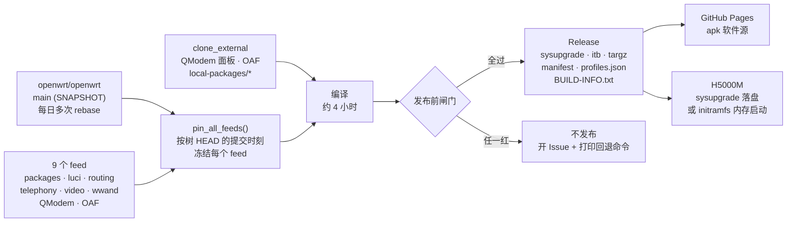
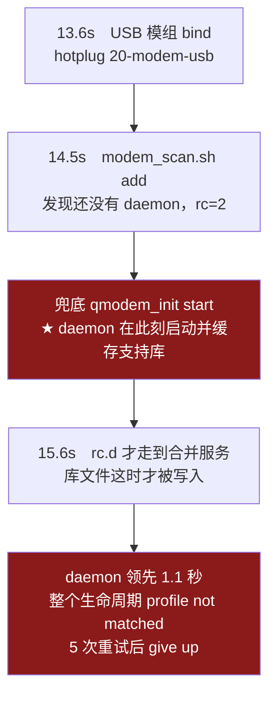

<div align="center">

# Hiveton H5000M · 主线 OpenWrt 构建工程

**`openwrt/openwrt` main → 可直接刷入的 sysupgrade / initramfs 镜像**

MT7987A (Filogic 860) + MT7992 (Wi-Fi 7) + Quectel RG520N-CN · **海狗 HigoOS 前端原样保留**

[](https://github.com/skyyzc/H5000M-Openwrt-Build/actions/workflows/build.yml)
[](https://github.com/skyyzc/H5000M-Openwrt-Build/actions/workflows/checks.yml)
[](https://github.com/skyyzc/H5000M-Openwrt-Build/actions/workflows/coverage.yml)
[](https://github.com/skyyzc/H5000M-Openwrt-Build/releases/latest)
[](https://github.com/skyyzc/H5000M-Openwrt-Build/commits/higoros-qmodem)
[](LICENSE)

[下载固件](https://github.com/skyyzc/H5000M-Openwrt-Build/releases/latest) ·
[软件源](https://skyyzc.github.io/H5000M-Openwrt-Build/) ·
[工程文档](docs/README.md) ·
[已知限制](#已知限制)

</div>

---

## 这是什么

一台被社区半放弃的 5G CPE，回到主线 OpenWrt 上继续跑：**内核跨一代、包管理器换成 apk、Wi-Fi 换成主线 mt76、5G 换成 QModem**——而机身上那块随设备出货的 **HigoOS 面板照旧能用**，不是拿 LuCI 换个皮。

支持来自上游本身（`target/linux/mediatek/image/filogic.mk :: Device/hiveton_h5000m`），本工程不维护 DTS、不维护端口布局，只负责**把这块板子该有的东西装全、钉住、验完再发**。

| | 原厂 HigoOS（ImmortalWrt 24.10） | 本固件（主线 SNAPSHOT） |
| --- | --- | --- |
| 内核 | 6.6.94 | **6.18.55**（跨代） |
| 包管理 | `opkg` | **`apk`** |
| Wi-Fi | vendor `mt_wifi.ko`（Proprietary，45 MB） | **主线 mt76**：`kmod-mt7996e` + `kmod-mt7992-23-firmware` |
| 5G 栈 | vendor qmi + 面板私有接口 | **主线 `qmodem`** + RG520N-CN 支持库（构建期烘入镜像） |
| 硬件加速 | MTK HNAT / TurboACC | **主线 PPE**（`fw4` 的 `flow_offloading_hw`），另有 eBPF 快路径 |
| 应用过滤 | OpenAppFilter | **OpenAppFilter**（保留） |
| HigoOS 面板 | 原厂 | **原样保留**，`:80`；传统 LuCI 挪到 `:8080` |

> 本仓库基于 [existyay/AutoBuild-H5000M-Openwrt](https://github.com/existyay/AutoBuild-H5000M-Openwrt) 改造而来，
> 在它的通用构建骨架之上加了 **HigoOS 保真层、QModem 5G 栈、OAF、上游钉版与自动前移**。
> 默认分支是 **`higoros-qmodem`**（不是 `master`）。

## 它是怎么做出来的



**为什么要有「钉版」这一步。** 上游 `main` 每天多次 rebase，feed 也是一天一个样。只钉树、不钉 feed，构建就变成日历的函数——同一棵树、同一个 pin，相隔 19 小时可以是 `BUILD OK` 也可以是 qmodem 被整体剔除。所以 feed 的截止时刻由**树的 HEAD 提交时刻派生**，让「树与 feed 同期」从愿望变成构造性事实。

**发布前不过闸门就不出货。** 四层 fullcone 链路、代理栈所需的每个 kmod 是否真在镜像里、以及**发布出去的软件源能不能独立满足所有前端**——任一红即中断，不会留下一个"看着像成功、装上才发现少东西"的 Release。

---

## 下载与刷机

到 [Releases](https://github.com/skyyzc/H5000M-Openwrt-Build/releases/latest) 挑文件：

| 文件 | 用途 |
| --- | --- |
| `*-squashfs-sysupgrade.bin` | **落盘刷机用这个** |
| `*-initramfs.itb` / `*-initramfs-kernel.bin` | **内存启动**：跑起来但一字节不写 flash，适合先验证再落盘 |
| `*-targz-rootfs.tar.gz` | 容器 / chroot |
| `*.manifest` | 镜像里到底有哪些包（换掉 `apk`/`opkg` 也能对着看） |
| `profiles.json` | 设备 profile 与镜像元信息 |
| `BUILD-INFO.txt` | 上游版本、**内核 ABI**、本次开启了哪些功能开关 |

### 落盘刷机

LuCI（`:8080`）里「系统 → 备份/刷写固件」，或命令行：

```sh
sysupgrade -v /tmp/openwrt-*-sysupgrade.bin
```

> **从原厂 / 旧固件过来，建议 `sysupgrade -n` 干净刷。** 内核从 6.6 跨到 6.18、包管理器从 opkg 换成 apk，保留旧配置没有意义。
> 刷前把 `/etc/config/` 和你自己放的文件先备份走，`sysupgrade -n` 不会替你留。

### 内存启动（零风险验证）

H5000M 的 U-Boot 自带 failsafe，上传 initramfs 镜像后系统在内存里跑，**不碰 flash**：

| 进入方式 | 做法 | 地址 |
| --- | --- | --- |
| **按住 reset 上电**（唯一能让页面真正可用的方式） | 按住复位键 → 上电 → 保持 5~10 秒 → 松开；电脑网卡设自动获取 | <http://192.168.9.1>（别名 <http://failsafe.lan>） |

> **⚠ 系统内执行 `to-failsafe`：进得去，但网络起不来。** 它写的是 U-Boot 环境里的 `failsafe`
> 标志（`/etc/fw_env.config` 已就位），**不刷任何分区**，U-Boot 也确实认得它、不再跑 `bootcmd`。
> 但**实测**走这条路重启后，电脑网卡会停在 APIPA `169.254.x`，`ping 192.168.9.1` 报
> "无法访问目标主机"、`arp -a` 零动态条目 —— **那个页面上根本没有东西在应答，够不着。**
> ⇒ 要操作 failsafe 页面，**只能按 reset 上电**。`to-failsafe` 的定位是"先把标志置上，
> 等人到设备跟前再按 reset"，而不是远程一条命令搞定。
>
> 标志是**一次性**的：进了那个页面就会被自动抹掉。主动放弃用 `fw_setenv failsafe`（删）或
> `to-failsafe -C`（清）。该工具的接口：`-n` 只置标志不重启（**不是 dry-run**）、`-c` 查、`-C` 清。
> 页面上的 `factory` 功能**不要点**——它动的是 EEPROM。

> 内存启动的系统 root 是空口令，SSH 用 `auth_none` 即可。

### 首启默认值

| 项目 | 默认 |
| --- | --- |
| 管理地址 | **<http://192.168.88.1>**（延续原厂出厂值） |
| 面板分工 | `:80` = HigoOS 面板 · `:8080` / `:8443` = 传统 LuCI |
| 主机名 | `Hiveton H5000M` |
| DHCP 池 | `.100 ~ .249`，租期 12h |
| Wi-Fi | SSID `openwrt`，**无密码（开放网络）** |
| 国家码 | `CN` |

> **默认是开放网络，连上后请立刻设密码**（HigoOS 面板或 LuCI 里都可以改）。
> 首启脚本只写一次，之后不会覆盖你改过的设置。

---

## 装更多软件包

固件已经内置本工程**自己的软件源**（构建同批产出的 520 个包），代理面板、AdGuardHome 之类直接装：

```sh
apk update
apk add luci-app-passwall
```

| 软件源里有什么 | 数量 |
| --- | --- |
| 代理 / 网络前端 | 15（PassWall、PassWall2、HomeProxy、MosDNS、Nikki-RS、Momo、NeKoBox、v2rayA、OpenClash、SSR-Plus…） |
| 与前端配套的核 / 守护进程 | 12（Xray、Mihomo、sing-box…） |
| 内核模块 | 20 |
| 中文语言包 | 12 |

**内核模块与固件出自同一次构建，`vermagic` 天然一致**，不会出现"官方源里的 kmod 装不上"。这恰恰是必须自带软件源的原因：官方 snapshot 的 kmod 与本固件的内核对不上。

面板要用到的内核侧依赖已经**编进固件本身**：

| 已内置 | 作用 |
| --- | --- |
| `kmod-tun` / `ip-full` | TUN 模式（面板提示"需要 ip-full 和 kmod-tun"已是过去式） |
| `kmod-nft-socket` / `kmod-nft-tproxy` / `kmod-nft-fullcone` | 透明代理与 FullCone |
| `dnsmasq-full` / `ipset` / `kmod-ipt-ipset` | adblock 的 `dnsmasq.ipset` / `dnsmasq.nftset` 后端 |
| `ucode-mod-math` | HomeProxy 依赖，缺了面板起不来 |
| `sing-box` 1.12.25 | **钉住版本**，避免被上游快照里的新版顶掉 |

> `apk update` 若出现 `UNTRUSTED signature`，说明索引签名没验过——正常构建不会出现：索引由本次构建的密钥签名，对应公钥就在固件的 `/etc/apk/keys/`。

---

## 固件里到底有什么

| 功能 | 组成 |
| --- | --- |
| **HigoOS 面板** | `higorosd`（Go 静态二进制，`:80`）+ Vue3 SPA + `luci-app-higoros`；CPE 页的数据面直接走 QModem 的 ubus（`qmodem` / `qmodem_sms` / `modem_ctrl`） |
| **5G 拨号** | `qmodem` + `luci-app-qmodem-next` + `luci-app-qmodem-generic` + `quectel-CM-5G-M` + `sms-forwarder-next` / 主线 `kmod-usb-net-qmi-wwan` |
| **应用过滤** | OpenAppFilter：`appfilter` + `luci-app-oaf` + `kmod-oaf` |
| **风扇温控** | overlay 内的 `fancontrol` v2（保留 HigoOS 页面契约，uci `fancontrol.settings.*`）+ HigoOS 风扇页 |
| **出口优先级 / 网络加速** | `luci-app-h5000m-accel`（主线 flow offload）；出口选择由 HigoOS 面板负责 |
| **UPnP IGD** | `miniupnpd-nftables` + `luci-app-upnp` |
| **MosDNS** | 开箱已装 |
| **主题 / 终端** | Argon + `ttyd` |
| **软件源** | 固件内已烘焙 `/etc/apk/repositories.d/50-h5000m.list`（`sysupgrade` 会保留） |

硬件加速走**主线自己的 PPE 卸载**（`fw4` 的 `flow_offloading_hw`），首启已自动开启。它和 ImmortalWrt 上的 TurboACC / MTK HNAT **不是一回事**，后者在主线这个 SoC 上并不存在。

---

## 两个绕不过去的设计取舍

### 1. 谁说了算：一个功能只能有一个管理者

同时开两个管同一件事的服务，结果是两个都以为自己在管事。本工程在配置阶段就把冲突拆掉，并且**打印它拆了什么**：

| 冲突 | 处理 |
| --- | --- |
| QModem ↔ `wwand` ↔ `luci-app-mt5700m` | 三者都想独占蜂窝数据通路 ⇒ **互斥**，保留 QModem，另两个自动关掉 |
| HigoOS 面板 ↔ `luci-app-h5000m-fancontrol` ↔ `luci-app-h5000m-netmode` | 海狗面板自带风扇页与网络页 ⇒ **自动关掉那两个 LuCI 包**，避免两个控制器抢同一路 PWM |

这解释了一个看起来奇怪的现象：`BUILD-INFO.txt` 里 `enable_fancontrol=false` 而风扇照常工作——风扇由 overlay 里的 `fancontrol` 服务管，海狗页在管它。

### 2. 5G 支持库：烘进镜像，而不是开机赛跑

<details>
<summary><b>展开：为什么"把顺序调对"这条路走不通</b></summary>

`modem_scand` **只在启动时读一次** `/usr/share/qmodem/modem_support.json`，然后**把内容缓存在内存里**，此后每轮扫描都用缓存、不再重读文件。而镜像里那个库**不含 RG520N-CN**——那一条是 `luci-app-qmodem-generic` 在**运行时**合并进去的。于是谁先谁后就成了成败关键：



daemon 有一条**完全绕开 rc.d** 的启动路径（USB 热插拔的 `rc=2` 兜底），**比合并服务早 1.1 秒**。所以任何"把合并排到 daemon 前面"的方案（改 `START=` 编号）都是在和 udev 赛跑——实测调过了，`START=78` 依然输。

**根治办法是在构建期把合并结果烘进镜像**：直接改写 QModem 包自带的那份 `modem_support.json`，把面板里的 `extra_modem_support.json` 合并进去。这样谁在什么时候拉起 daemon 都无所谓，运行期那个注入服务自然退化成安全网。

代价是合并语义必须与官方注入器**逐字节一致**（插入位置、行尾逗号、8/12/16 空格缩进），所以合并结果会与设备上一次运行时产出的真实文件做 `cmp` 对拍——本机对拍无差异才允许上机。构建时还会**回读文件并断言新型号确实在里面**，否则直接 `die`：静默 no-op 正是这个 bug 本身，代价是四小时后一句"没生效"。

</details>

---

## 自己编译

### 在线构建（默认方式）

**Actions → 构建 H5000M 主线 OpenWrt 固件 → Run workflow**，或命令行：

```sh
gh workflow run build.yml --ref higoros-qmodem
```

构建完固件自动发成 Release，软件源自动发到 GitHub Pages（`publish-apk-repo.yml` 会跨 run 取回同批的 apk 工件），本机不需要任何交叉编译环境。

默认每周一 12:00（北京时间）自动构建一次，并在**探测轨通过时自动前移钉版**：只有"自己真的编译出完整镜像且四道闸门全过"的修订才会被钉住——红探测则不动钉版、不发版、开 Issue。

> **改了代码要手动派发**：`build.yml` 没有 `push` 触发器。用 `./scripts/dispatch-build.sh`，它会在派发前后核对 `headSha`，防止"跑的是旧代码，于是得出结论说修复没用"。

### 本地编译（调试用）

```sh
./scripts/local-build.sh --install-deps    # 依赖：Debian/Ubuntu 用 apt，Arch 用 pacman
./scripts/local-build.sh                   # 全量编译
```

产物在 `artifacts/`：sysupgrade 镜像、rootfs、manifest，以及可给设备直接安装的 apk 仓库。

> **源码树和工具链会留在本机**，编译完 `openwrt/` 约 **70 GB**。用完请删：
>
> ```sh
> rm -rf openwrt artifacts artifacts-coverage logs build.log coverage-*.log
> ```
>
> 若 `/home` 是 btrfs 且装了 snapper，空间要等包含这棵树的快照被清掉才会真正释放（见「已知限制」）。

常用环境变量：

| 变量 | 默认 | 说明 |
| --- | --- | --- |
| `H5000M_WIFI_SSID` | `openwrt` | 首启 SSID |
| `H5000M_WIFI_KEY` / `_ENCRYPTION` | 空 / `none` | 默认开放网络 |
| `H5000M_APK_REPO_URL` | 空 | 软件源基址；留空则固件不带额外源 |
| `ENABLE_QMODEM` / `ENABLE_OAF` / `ENABLE_HIGOROS` | 在线构建固定开 | 5G 栈 / 应用过滤 / 海狗保真层 |
| `ENABLE_PASSWALL` / `ENABLE_PASSWALL2` | `true` | 编进软件源（`=m`），不占镜像体积 |
| `ENABLE_MOSDNS` | `true` | MosDNS 直接装进固件 |
| `ENABLE_HOMEPROXY` / `ENABLE_ADBLOCK` | `false` | 装进软件源，`apk add` 即得 |
| `ENABLE_DOCKERMAN` / `ENABLE_NIKKI` / `ENABLE_OPENCLASH` / `ENABLE_ADGUARDHOME` | `false` | 可选服务（`ENABLE_NIKKI` 会克隆并构建 Nikki-RS / clash-rs） |
| `ENABLE_EBPF_PROXY_KERNEL` | `true` | 写入 `CONFIG_KERNEL_CGROUPS` / `CONFIG_KERNEL_CGROUP_BPF`（会改变内核 ABI） |
| `THREADS` | CPU 核数 | 并行度 |

其余开关（`ENABLE_WWAND` / `ENABLE_MT5700M` / `ENABLE_EASYMESH` / `ENABLE_THEME_ARGON` 等）与各自默认值以 `./scripts/local-build.sh --help` 为准。

想把软件源指向自己的服务器：

```sh
./scripts/serve-apk-repo.sh          # 另开一个终端，会打印该用的地址
H5000M_APK_REPO_URL=http://<你的地址>:8099 ./scripts/local-build.sh
```

### 验证软件源

确认某个固件对应的源能不能装，用设备自己的 apk 逻辑查一遍：

```sh
./scripts/verify-apk-repo.sh                       # 查刚编译出的 artifacts/apk-repo/
./scripts/verify-apk-repo.sh --with-official-feeds # 再加上官方源，等价于实机环境
./scripts/verify-apk-repo.sh https://<地址>/packages.adb   # 查已发布的源
```

它只配置指定的源，用构建出的 `apk` 建临时数据库，逐条断言 15 个面板、12 个核与守护进程、20 个 kmod、12 个中文语言包都在，`sing-box` 是钉住的 1.12.25，以及**每个面板都能解析出它需要的核**。

---

## 仓库结构

```
configs/           构建配置与上游基线
  h5000m.config       target 选择 + 本板的常开项（含上游 Hardware support 门禁的取舍注释）
  upstream.env        钉版基线：树 revision + feed 截止时刻（advance-pin 的唯一写入者）
higoros-overlay/   HigoOS 保真层：vendor higorosd、面板 SPA、首启脚本、风扇服务、failsafe 工具
local-packages/    本工程的包：h5000m-integration、luci-app-h5000m-accel、nft-fullcone
patches/           树侧补丁（含风扇策略）；另有 firewall4 / libnftnl / nftables / mt76 四组补丁
scripts/           local-build.sh、dispatch-build.sh、advance-pin.sh、verify-apk-repo.sh…
docs/              工程记录（选型论证、集成细节、逐条根因分析、kmod 审计）
```

---

## 已知限制

- **没有 TurboACC / MTK HNAT**：主线不提供。硬件加速走 PPE + netfilter flowtable，`fw4` 的 `flow_offloading_hw` 开着就已生效。
- **无线与 5G 需要真机验证**：仿真能验证脚本与启动流程，但射频、模组附着、风扇曲线这类依赖真实硬件的行为，只能上机确认。也正因如此，`-initramfs.itb` 那条内存启动路径才是推荐的第一次验证方式。
- **第一次开机 1~2 分钟内，面板上 5G 页面可能是空的**：`modem_scand` 重试阶梯是 5 次 × 8 秒，前端 axios 超时 30 秒、失败后每 5 秒重试，初始列表为空。**这是设计行为，不是故障**，等两分钟再看。
- 第三方代理面板由各自上游维护，本工程只负责把它们编译进仓库并保证依赖完整。
- **不要额外加 `nikki-rs.pages.dev` 源**：本固件的源已包含 `nikki-rs` / `clash-rs` / `luci-app-nikki-rs`，无需官方的 `feed.sh`。混用会出现 `UNTRUSTED signature`（该源公钥不在固件里），还可能装上 ABI 不一致的 `clash-rs`。已加过的，删掉 `/etc/apk/repositories.d/` 里那一行再 `apk update`。
- **`unexpected end of file` + `wget: exited with error 4` 是下载被截断，不是包缺失、也不是源坏了**：apk 用 busybox `wget` 取包（`apk-tools` 以 `-Durl_backend=wget` 编译），把 wget 的退出码 4 解释成"网络不可达"。链路抖动或 5G 侧 MTU/PMTU 异常都会让稍大的文件传不完。**判据**：出错的几条若来自**不同主机**（官方快照、第三方 feed、本固件的源），那就与某个源无关，是这条链路。先重试；反复失败再查传输层（`ip link show` 看拨号口 MTU，`wget -O /dev/null '<出错的 URL>'` 复现一次即可确认）。
- **不要盲目 `apk upgrade`**：镜像里保留了官方 snapshot 源，那些版本比本工程构建的更新——`apk` 取最高版本，升级会把钉住的 `sing-box` 换成 1.13+（HomeProxy / PassWall2 会因此起不来），也可能换上与内核不匹配的 kmod。装包用 `apk add <包名>` 就好。
- **需要本工程没编进去的 kmod 的包装不上**：kmod 必须与内核 vermagic 一致，官方源里的对不上。遇到这种包，得把它加进构建配置重新编译。
- **btrfs + snapper 的机器上，删掉本地构建产物不等于立刻回收空间**：本机全量编译后 `openwrt/` 约 70 GB，删掉之后 `df` 可能仍是满的——snapper 的 timeline 快照还引用着那棵树。`sudo snapper -c home list` 找到构建期间的快照并 `sudo snapper -c home delete <编号>` 才会真正释放。

<details>
<summary><b>深水区：eBPF 与内核选项（给要动代理加速的人）</b></summary>

代理侧的加速是 **Nikki-RS（clash-rs）的 eBPF 快路径**：固件默认编译了 cgroup BPF 与 TC eBPF 所需的全部内核选项（`CONFIG_CGROUP_BPF`，以及 `kmod-sched-core` / `kmod-sched-bpf` 带来的 `cls_bpf`、`act_bpf`），并把 eBPF 管理器建 datapath 所需的 `kmod-veth` 装进镜像（它用 netkit/veth 建 `dae0` / `dae0peer` 链路对）。装上 `luci-app-nikki-rs` 后在它的 eBPF 页面打开即可；「网络加速」页会报告 eBPF 内核支持是否就绪。

eBPF 是 **TUN / tproxy / redirect 之外的另一种入站**：内核钩子决定拦截还是放行，不再需要 nftables/iptables 转发规则；打开后 `Proxy Config` 里的 TCP/UDP 模式会被绕过（所以那里没有、也不需要「eBPF 模式」选项）。本固件已内置它需要的全部内核侧依赖，**不需要像社区里那样先装 `dae` 来补依赖**。

三件值得说清的事（上游 README 的依赖清单与本工程的配置逐条对过）：

- Nikki-RS 需要的 `kmod-nft-tproxy`（以及 `kmod-nft-socket`、`kmod-inet-diag`、`kmod-tun`、`kmod-dummy`、`ip-full`、`yq`）**全部 `=y` 装进镜像**，并在发布前的闸门里逐条断言。
- **`CONFIG_DEBUG_INFO_BTF` 已开启。** 它有两个前置条件，缺一个就会被 defconfig 静默丢掉：`depends on KERNEL_DEBUG_INFO && !KERNEL_DEBUG_INFO_REDUCED`。树里本来是 `DEBUG_INFO=y`，但 **`DEBUG_INFO_REDUCED` 默认是 `y`**，所以 BTF 一直被丢掉、内核实际上没有 BTF。现在这三个符号一起写入并在 defconfig 之后重新断言。代价是 gcc 要生成完整 DWARF、再由 `pahole`（`select DWARVES` 自动构建）转成去重后的 BTF：vmlinux 变大、内核编译变慢，这是本工程有意接受的权衡。
- 同时开启的是 Nikki-RS 真正需要的 cgroup BPF 那一半。`clash-rs` 本身是**预编译二进制**（包内 `Build/Compile` 为空，只下载上游 release 的 tarball），eBPF 字节码在上游发布流程里就已嵌入二进制；BTF 是给内核侧与 BTF/CO-RE 类工具（如 Daed）用的。`CONFIG_BPF_EVENTS` / `XDP_SOCKETS` 仍保持关闭。

四点注意：

- eBPF 页的 `Bypass Destination IPs` **必须包含你的内网网段**（默认含 `192.168.0.0/16`），否则去往路由器本身的流量也会被拦，直接失去管理入口。
- **IPv6 是同一条边界，而上游默认没有覆盖它**：本固件的局域网必然有 IPv6（`ula_prefix 'auto'` 自动生成 ULA，odhcpd 以它宣告 DNS），但默认清单在 IPv6 侧只有 `::1/128`、`fe80::/10`、`ff00::/8`——**ULA 不在其中**。于是"去往路由器自己"的 IPv6 包被内核钩子抓走，而同样的 IPv4 包被 `192.168.0.0/16` 放行，表现为 **IPv6（AAAA）解析失败、IPv4 正常**。本固件已把 `fc00::/7` 补进默认值，并在开机与「保存并应用」时按设备实际 LAN 前缀自动补齐（只增不删、幂等）；命令行可用 `/usr/sbin/h5000m-accel check-bypass` 查看缺失项。
  另外，eBPF 打开后 Nikki-RS 的 TCP/UDP 页上「IPv6 DNS 劫持 / IPv6 代理」**不生效**（`nikki-rs.init` 在 eBPF 模式下直接返回，那两个开关属于 nftables 路径），此时决定 IPv6 的只有核心自己的 `mixin.ipv6` / `mixin.dns_ipv6`。用 `uci -q get nikki-rs.mixin.ipv6` 核对：**空值**意味着 clash-rs 退回自己的默认值「IPv6 关闭」，AAAA 会返回空。
- **第一次调试不要打开 Nikki-RS 的开机自启**（`boot_start`）；确认策略没问题之后再开。
- `dnsmasq.ipset`（adblock）与 eBPF 无关；eBPF 的透明代理端口是它自己的 `tproxy-port`（默认 12345），不用去配 `Proxy Config` 的 tproxy 端口。

</details>

---

## 文档

| 文件 | 内容 |
| --- | --- |
| [docs/README.md](docs/README.md) | 文档索引 |
| [docs/engineering.md](docs/engineering.md) | 上游选型论证、组件集成细节、实机问题的逐条根因分析、软件包审计、仿真测试结论 |
| [docs/proxy-kmod-audit.md](docs/proxy-kmod-audit.md) | 各代理软件所需内核模块的逐包证据（含审计时的 commit） |
| [docs/ci.md](docs/ci.md) | 工作流与闸门 |
| [docs/conventions.md](docs/conventions.md) | 提交与代码约定 |
| [CHANGELOG.md](CHANGELOG.md) | 变更记录 |

## 许可证

见 [LICENSE](LICENSE)。
